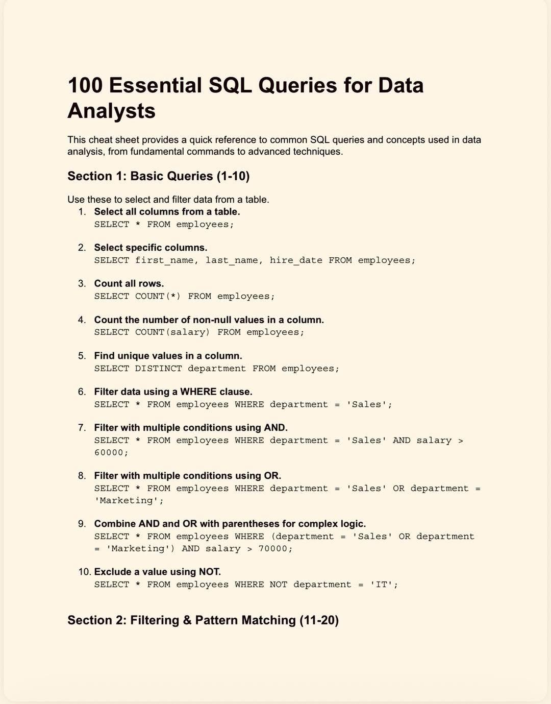
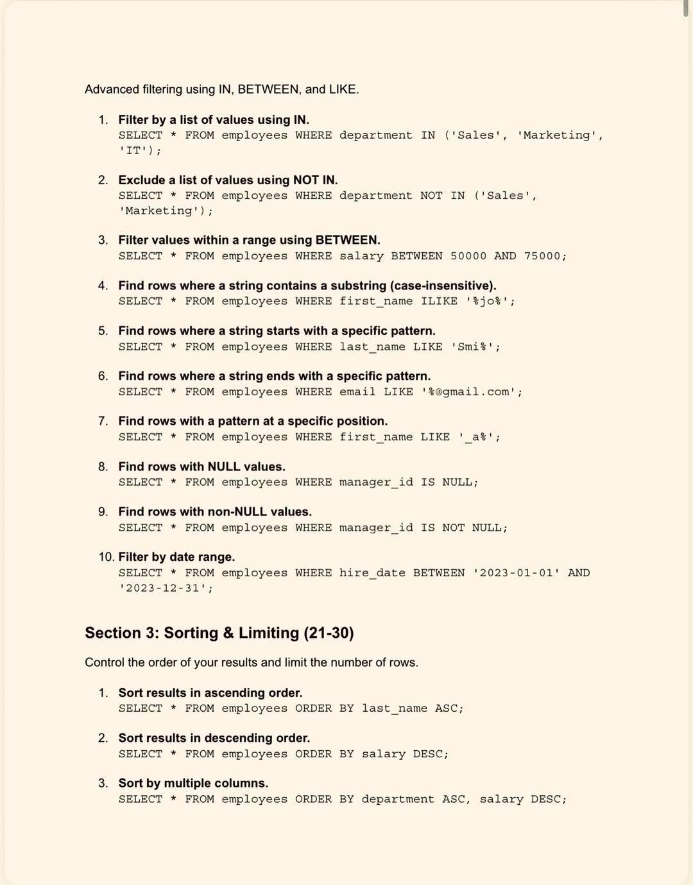
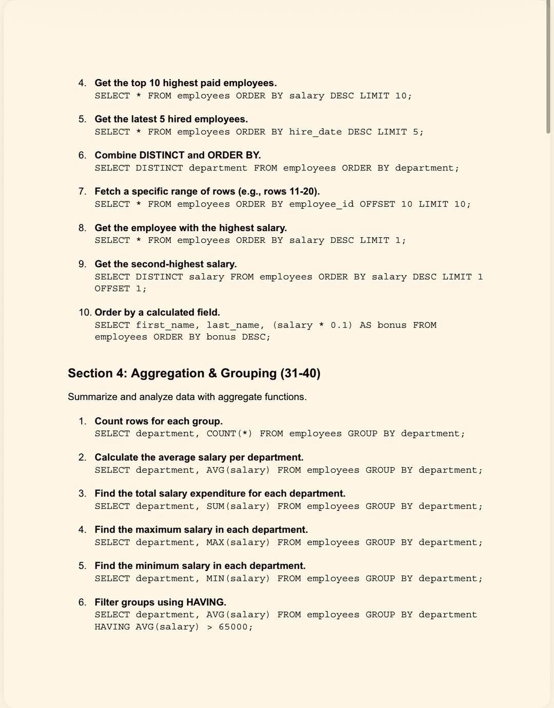
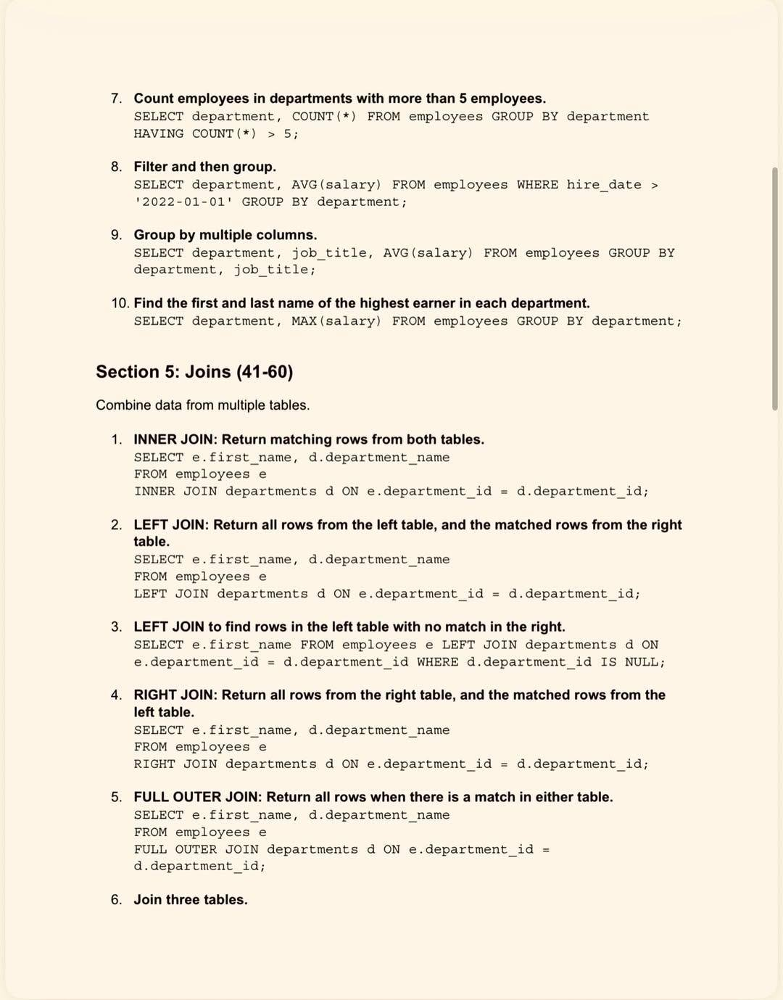
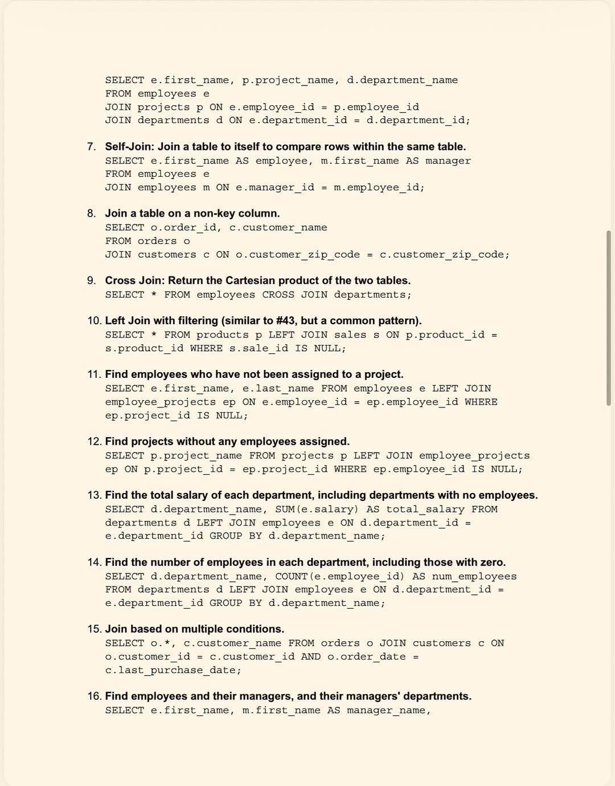
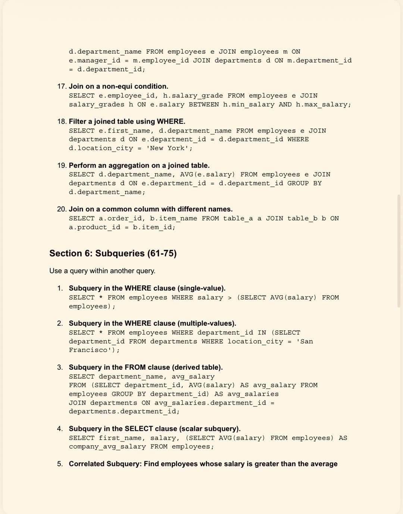
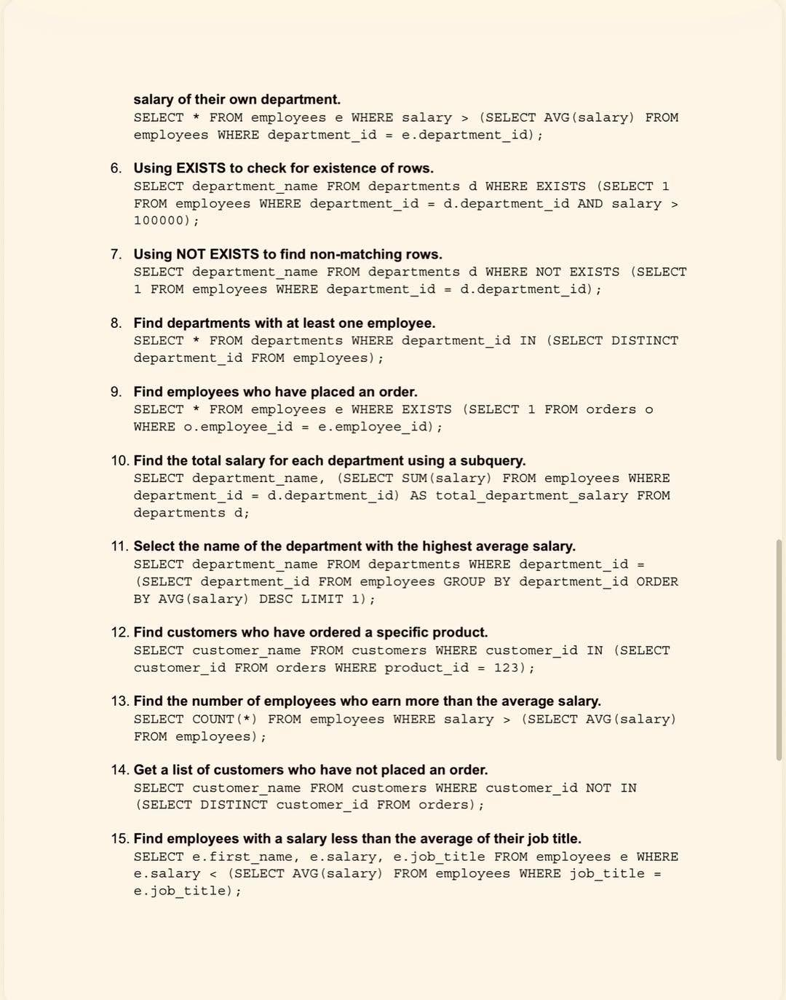
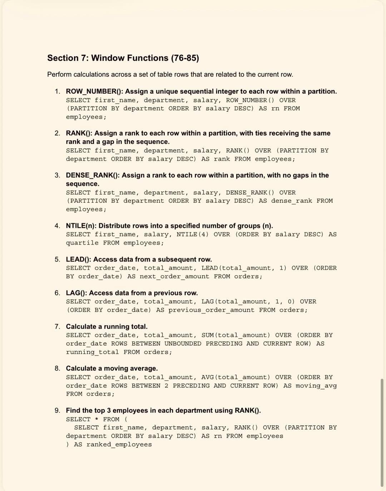
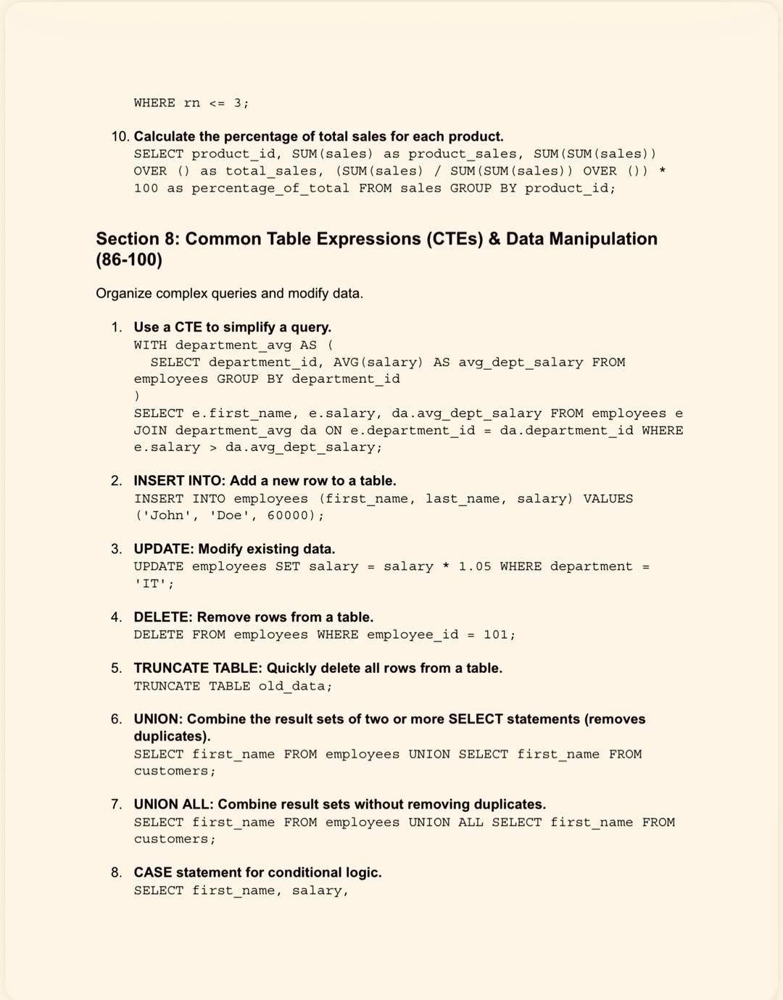
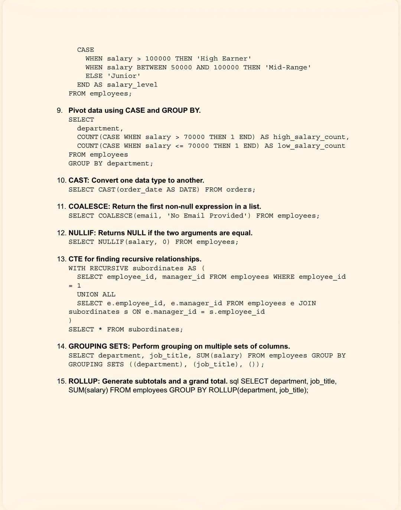

# SQL Cheat Sheet — 100 Essential SQL Questions

This cheat sheet provides a quick reference to common SQL queries and concepts used in data analysis, from fundamental commands to advanced techniques.  
They are organized into ten cheat sheet images that you can view directly below.

